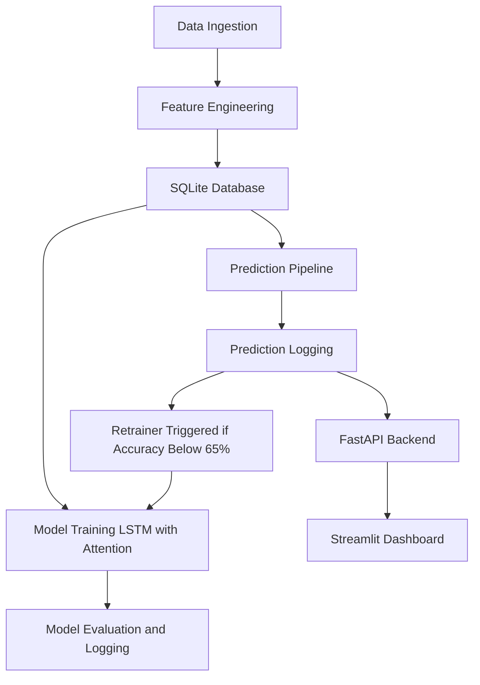

# 🌍 CO₂ Emission Forecasting System

This is a full-stack **MLOps pipeline** for real-time forecasting of CO₂ emissions using energy production data from the Danish Energy API. The project automates **data ingestion, feature engineering, model training, prediction, evaluation, and retraining**, all deployed in a containerized architecture with a **Streamlit frontend**, **FastAPI backend**, and **scheduled cron jobs** for continuous operation.

---

## 🚀 Project Architecture


---
## 📦 Tech Stack

| Layer        | Tools / Frameworks                                                                 |
|--------------|-------------------------------------------------------------------------------------|
| Data & Storage | SQLite, Pandas, Energi Data Service API                                            |
| ML Framework  | PyTorch, Scikit-learn                                                              |
| Automation    | Cron (every 6 hours), Docker                                                       |
| Backend       | FastAPI                                                                            |
| Frontend      | Streamlit + Plotly                                                                 |
| MLOps Features| Versioning, Evaluation, Logging, Retraining, Scalers, Metadata DB, Drift Detection |

---

## 📁 Folder Structure

```
app/
├── backend/               # FastAPI app
├── frontend/              # Streamlit dashboard
├── scheduler/             # Cron-based job runner
├── scripts/               # Core logic for data, model, prediction
│   ├── data_pipeline/     # ETL: Fetch, process, feature engineering
│   ├── model_pipeline/    # Model: train, evaluate, log, utils
│   └── prediction_pipeline/ # Predict, evaluate, retrain if needed
├── database/              # SQLite DB lives here
├── models/                # Trained PyTorch models + scalers
├── logs/                  # Log files for pipelines and cron
├── Dockerfile.base        # Base image (Python + Torch + deps)
├── docker-compose.yml     # 3-service orchestration
```

---

## 🔁 MLOps Lifecycle

### 🛠️ 1. Data Ingestion (every 6 hours via cron)
- Pulls raw data from Denmark's real-time power production API.
- Aggregates and interpolates missing values.
- Stores `aggregated_data` and `engineered_features` in SQLite.

### 🧠 2. Model Training
- Sequence model: **Attention-LSTM**
- Uses 24-hour input to predict the next 6 hours.
- Metrics tracked: MAE, RMSE, R², MAPE, Pseudo Accuracy.
- Model artifacts and scalers are versioned and saved.

### 🔮 3. Prediction Pipeline
- Runs every 6 hours (post data update).
- Predicts next 6 hours using the best-performing model.
- Saves predictions in the DB with timestamps.

### 📉 4. Evaluation + Drift Handling
- When actual values become available, evaluates last predictions.
- If pseudo-accuracy < 65%, retrains model using **last 2 years** of data.

### 🔁 5. Auto-Retraining Logic
- Triggered from `predict.py` if accuracy degrades.
- New model version is trained, evaluated, and stored with metadata.

---

## 🌐 Dashboards

### 🖥️ Streamlit App (on port `8501`)
- View last 24 hours of actual CO₂ emissions.
- View next 6-hour predictions.
- Compare recent predictions vs actuals.
- See best model details with metrics.

### 🛠️ FastAPI Backend (on port `8000`)
- Exposes `/last-24h-emissions`, `/next-6h-predictions`, `/best-model`, and more.
- Acts as API for frontend dashboard.

---

## 🐳 Running the Project (Dockerized)

```bash
# Build all services
docker-compose build

# Start all services
docker-compose up -d

# Scheduler runs pipelines every 6h, frontend and backend expose services
```

> You can monitor cron logs using:
```bash
docker exec -it co2-scheduler tail -f /app/logs/d_pipeline_cron.log
```

---

## 🧪 Database Schema Highlights

- `aggregated_data`: Hourly CO₂ and power features
- `engineered_features`: Lag + rolling stats
- `model_table`: Stores model hyperparameters & paths
- `predictions`: Forecasts (and actuals after arrival)
- `model_evaluations`: Evaluation metrics per model version
- `new_data_log`: ETL audit trail
- `model_training_sets`: Which time range was used to train each model

---

## 📊 Model Info

| Component         | Description                                      |
|------------------|--------------------------------------------------|
| Model Type        | LSTM + Attention                                |
| Input Window      | 24 hours                                         |
| Output Window     | 6 hours                                          |
| Loss Function     | MSE                                              |
| Optimizer         | Adam                                             |
| Scheduler         | ReduceLROnPlateau (based on val loss)           |
| Early Stopping    | 5 epochs patience                                |
| Evaluation Metric | Pseudo Accuracy + MAPE, RMSE, R², MAE, MSE       |
| Scaling           | MinMaxScaler (features and target)              |

---

## 📆 Cron Schedule (in Scheduler)

Runs every 6 hours:

```cron
0 */6 * * * cd /app && /usr/local/bin/python -u scripts/data_pipeline/d_pipeline.py >> /app/logs/d_pipeline_cron.log 2>&1 && /usr/local/bin/python -u scripts/prediction_pipeline/predict.py >> /app/logs/predict_cron.log 2>&1
```

---

## 🧠 Auto-Retraining Logic

- After predictions are evaluated against actuals
- If pseudo-accuracy < `65%`, `retrain_model()` is triggered
- Uses last 2 years of data for training
- New version of model is logged and used for next prediction cycle

---

## 📝 License

MIT License. See `LICENSE.md` for details.
```
